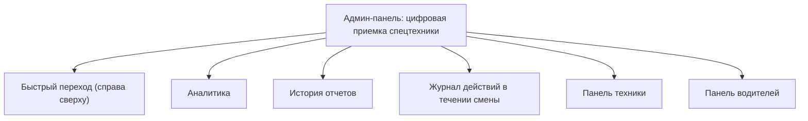
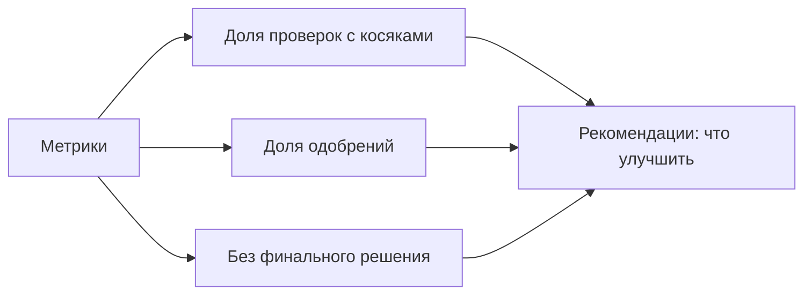
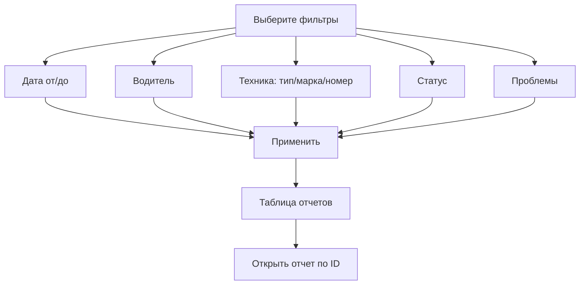
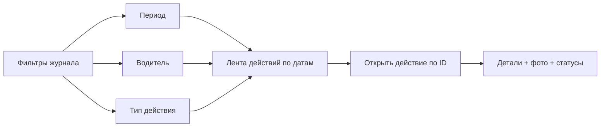
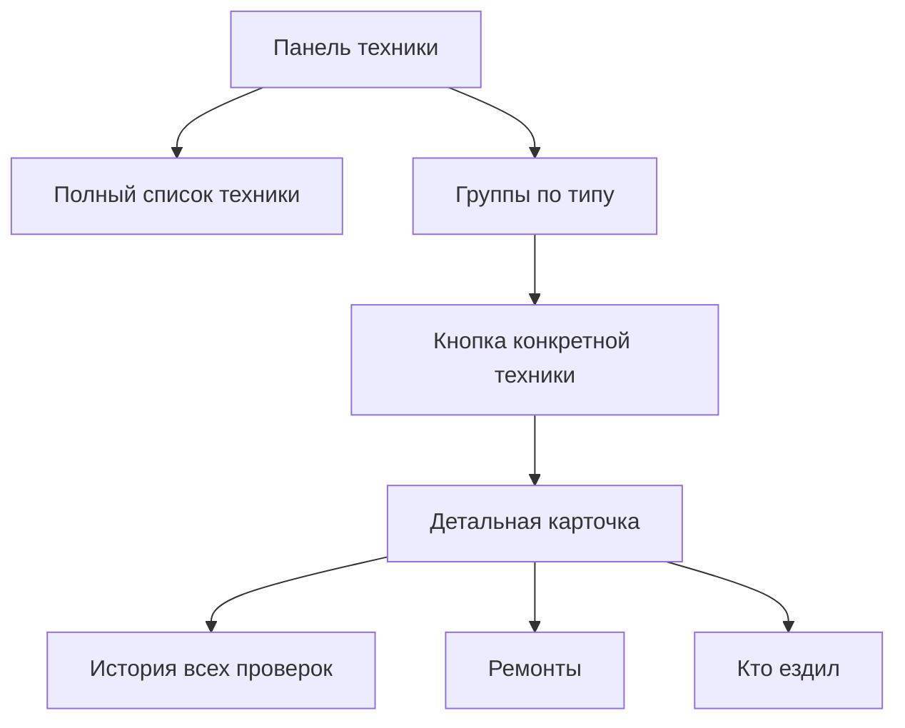
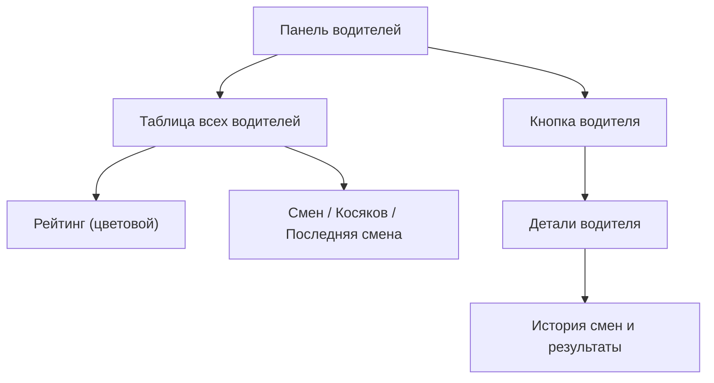

# Инструкция по использованию админ-панели

Эта инструкция поможет быстро освоить админ-панель приемки спецтехники: где смотреть аналитику, как находить нужный отчет, как проверять дневные действия, технику и водителей.

---

## 1) Как открыть панель

Локально:

```bash
streamlit run admin_dashboard.py
```

На сервере (если уже поднято через Docker Compose):
- Откройте URL панели в браузере (обычно порт `8501`, если не меняли).

---

## 2) Быстрый обзор экрана (картинка-схема)



Что важно:
- В правом верхнем углу есть раскрываемое меню `Быстрый переход`.
- По клику на пункт меню страница сразу прокручивается к нужному разделу.

---

## 3) Раздел «Аналитика»

В этом блоке есть:
- Ключевые метрики: `Всего проверок`, `Сегодня`, `С проблемами`, `Одобрено`.
- Блок `Рекомендации по реализации` — автоматические подсказки по текущим данным.



Как читать:
- Высокая доля косяков -> усилить предрейсовый контроль.
- Много незавершенных приемок -> ускорить обработку решений механиком.

---

## 4) Раздел «История отчетов»

Здесь вы находите приемки через фильтры и открываете детали по ID.



Пошагово:
1. Выставьте фильтры.
2. Нажмите `Применить`.
3. Найдите нужный ID в таблице.
4. В поле `Открыть отчет по ID` введите ID.
5. Нажмите `Показать детали`.

В карточке отчета доступны:
- Основные данные (водитель, техника, дата).
- Итог по чек-листу.
- Проблемные пункты и фото неисправностей.
- Обязательные фото техники.

---

## 5) Раздел «Журнал действий в течении смены»

Показывает действия водителей в течение дня (`Заправка`, `Завершение смены`, `Обслуживание`).



Как использовать:
1. Отфильтруйте журнал по периоду/водителю/типу.
2. Откройте действие по ID.
3. Проверьте:
   - статус действия,
   - решение по ГСМ (для заправки),
   - статус доставки,
   - приложенные фотографии.

---

## 6) Раздел «Панель техники»

В этом разделе техника сгруппирована по типам, и для каждой единицы доступна история.



Пример применения:
- Нужно оценить проблемную машину -> откройте технику -> вкладка `Ремонты`.
- Нужно понять, кто чаще ездил -> вкладка `Кто ездил`.

---

## 7) Раздел «Панель водителей»



Что смотреть в первую очередь:
- Колонку `Рейтинг` (быстрый индикатор качества).
- Количество `Косяков`.
- `Последняя смена` (контроль активности).

---

## 8) Частые сценарии работы

### Сценарий 1: Найти проблемные приемки за неделю
1. Перейдите в `История отчетов`.
2. Поставьте период за последние 7 дней.
3. В фильтре `Проблемы` выберите `есть косяки`.
4. Просмотрите таблицу и откройте нужные ID.

### Сценарий 2: Проверить заправки конкретного водителя
1. Откройте `Журнал действий в течении смены`.
2. Выберите водителя и `Тип действия -> Заправка`.
3. Откройте действия по ID и проверьте фото/статусы.

### Сценарий 3: Разобрать повторяющиеся поломки по технике
1. Перейдите в `Панель техники`.
2. Откройте нужную единицу техники.
3. Анализируйте вкладки `История всех проверок` и `Ремонты`.

---

## 9) Короткая памятка

- `Быстрый переход` — самый быстрый способ перемещения по большим разделам.
- Для точечной проверки используйте поля:
  - `Открыть отчет по ID`
  - `Открыть действие по ID`
- Начинайте сменный контроль с:
  1) `Аналитика`,
  2) `История отчетов`,
  3) `Журнал действий`.

